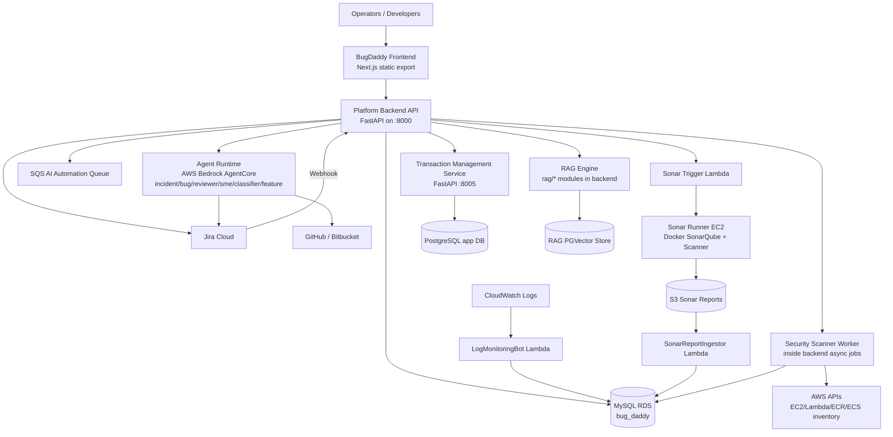
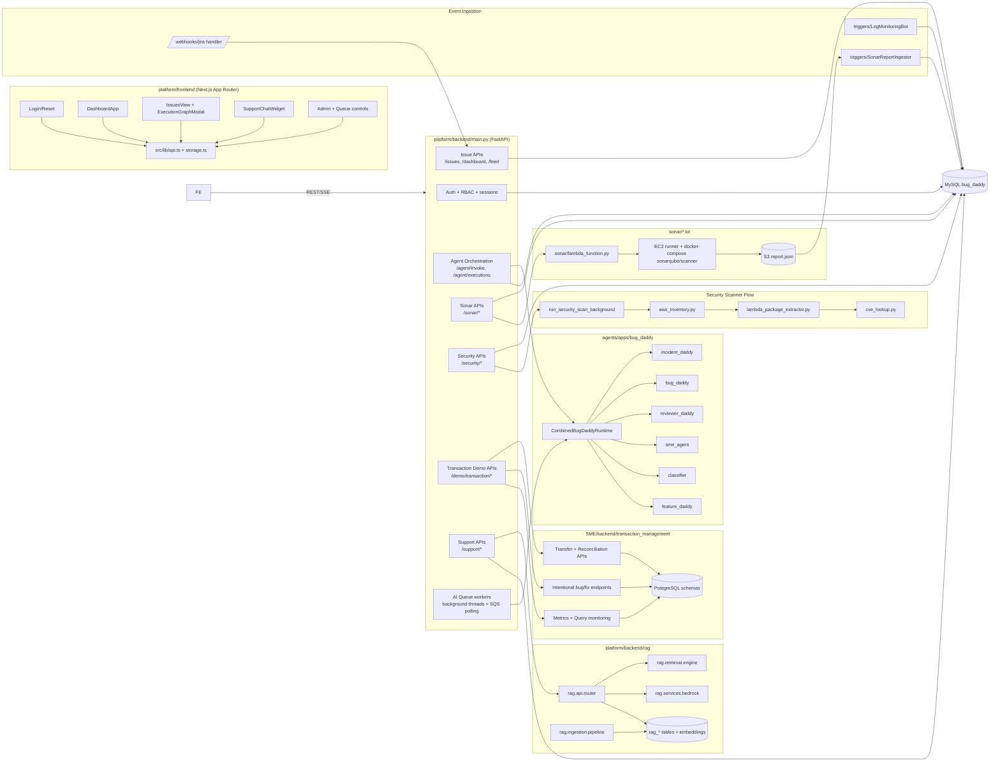
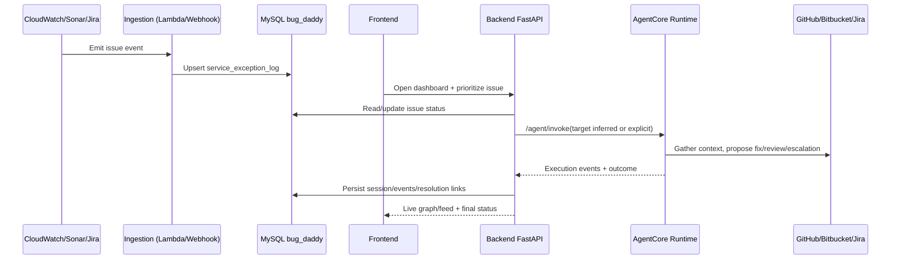

# BugDaddy Complete Architecture (HLD + LLD)

This document provides end-to-end architecture diagrams for the complete `bug_daddy` project.

## 1. High-Level Design (HLD)

## 2. Low-Level Design (LLD)

## 3. Core Runtime Sequence (Issue to Automated Resolution)

